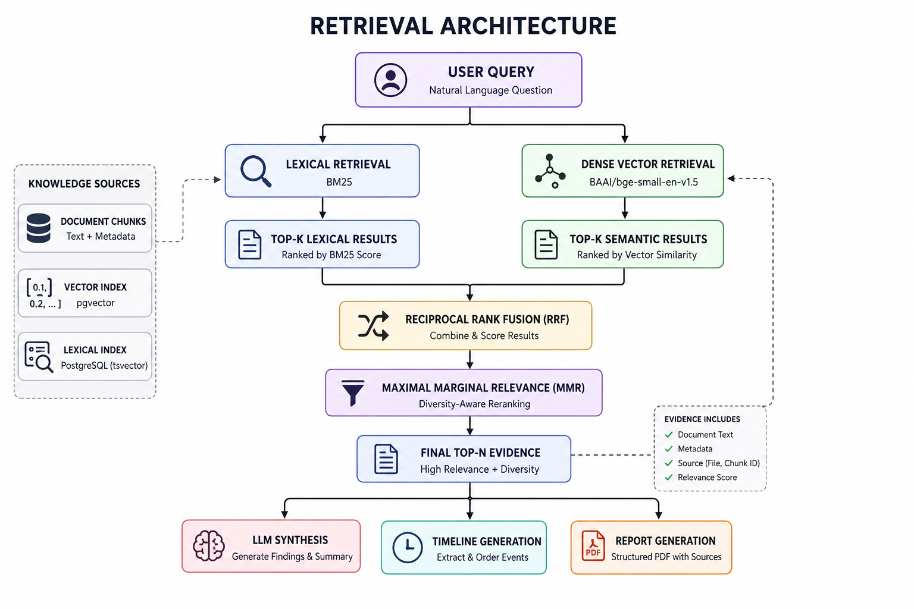

# RAG-Based Investigative Document Analysis

A document intelligence platform for exploring large investigative archives using Retrieval-Augmented Generation (RAG), hybrid retrieval, entity intelligence, and evidence-backed report generation.

Built on the Epstein Files dataset from Hugging Face: https://huggingface.co/datasets/teyler/epstein-files-20k

---

## Overview

The system enables users to search investigative documents, explore entities, generate timelines, and produce source-backed intelligence reports through a hybrid retrieval and synthesis pipeline.

Designed for large-scale document collections, it combines lexical search, semantic retrieval, reranking, and LLM-powered analysis while maintaining traceability to the underlying evidence.

---

## Features

### Evidence Locker
Search and retrieve relevant evidence from thousands of investigative documents.

### Document Intelligence
Inspect document contents, metadata, and extracted text.

### Entity Explorer
Explore people, organizations, locations, and recurring entities across the archive.

### Inquiry & Analysis
Generate evidence-backed findings and summaries from natural language queries.

### Timeline Generation
Automatically reconstruct chronological events from retrieved evidence.

### Report Export
Export intelligence reports as structured PDF documents.

---

## Retrieval Architecture


---

## Tech Stack

### Frontend
- Next.js
- TypeScript
- Tailwind CSS

### Backend
- FastAPI
- PostgreSQL
- SQLAlchemy
- pgvector

### Retrieval & NLP
- BAAI/bge-small-en-v1.5
- BM25
- Reciprocal Rank Fusion (RRF)
- Maximal Marginal Relevance (MMR)
- spaCy

### LLM
- Groq API
- Llama 3.1

### Reporting
- ReportLab

---

## Setup

### Clone Repository

```bash
git clone https://github.com/anishaachaudhuri/rag-epstein
cd project
```

### Backend

```bash
cd backend

python -m venv venv            #Windows
source venv/bin/activate       #Mac/Linux

pip install -r requirements.txt
```

Create a `.env` file:

```env
DATABASE_URL=...
GROQ_API_KEY=...
EMBEDDING_MODEL=...
```

Run the backend:

```bash
uvicorn app.main:app --reload
```

### Frontend

```bash
cd frontend

npm install
npm run dev
```

### Document Ingestion

```bash
python -m app.ingestion.ingest_runner
```

---

## Scale

- 25,000+ indexed documents
- 32,000+ document chunks
- 560,000+ extracted entities